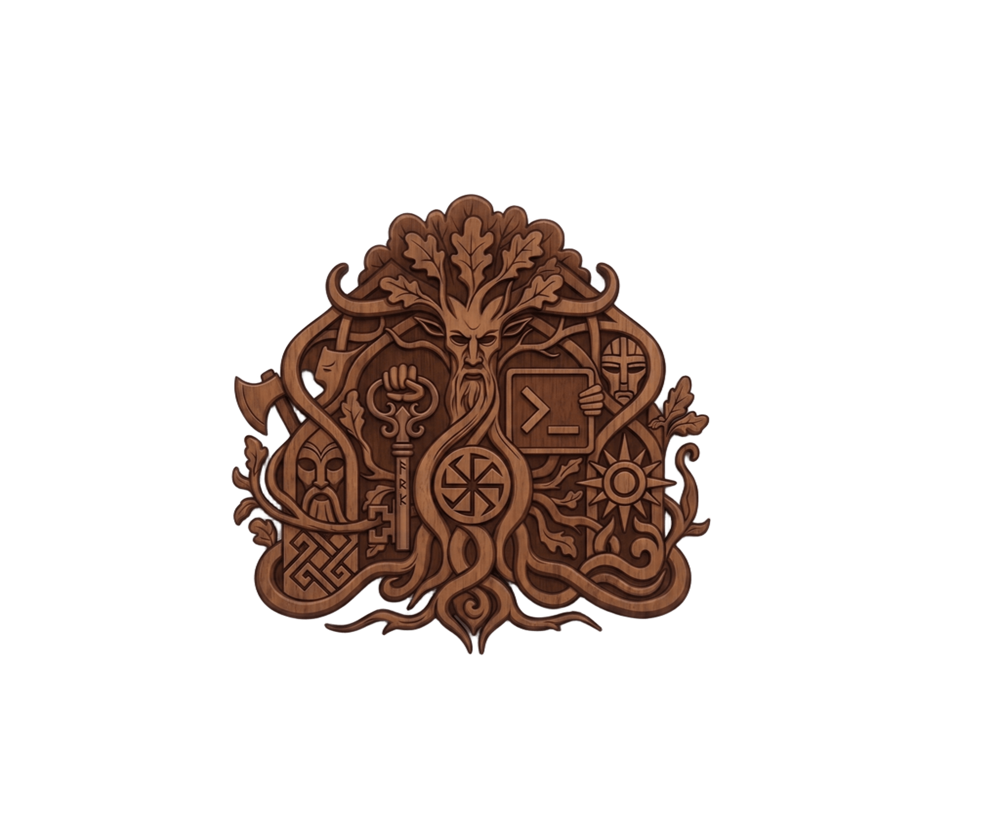
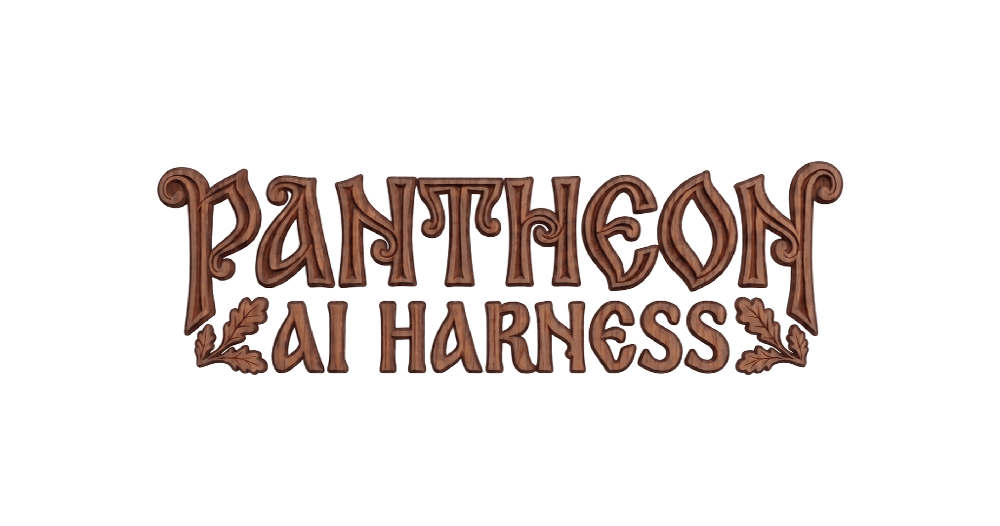

<p align="center">
  
  <br />
  
</p>

<p align="center">
  <em>An OpenCode-based harness for orchestrating AI agents.</em>
</p>

---

Pantheon provides a coordinator agent that delegates work to specialists, a QA agent for executing test plans, and per-agent model configuration.

## Primary agents

| Agent | Description |
|---|---|
| **Perun** | The coordinator. Delegates work to specialists, computes dispatch waves with dependency awareness, and synthesizes results. |

## Subagents

| Agent | Description |
|---|---|
| **Zmora** | QA tester. Executes FE and BE test scenarios on demand, dispatched by Perun. |

## Installation

Add to your OpenCode config:

```json
{
  "$schema": "https://opencode.ai/config.json",
  "plugin": [
    "av-opencode-plugins@git+https://github.com/AppVerk/av-opencode-plugins.git#v0.3.0"
  ]
}
```

Restart OpenCode after installation or any config change.

## Commands

| Command | Description |
|---|---|
| `/create-qa-plan` | Analyzes recent changes and generates a structured QA plan in `docs/testing/plans/`. |
| `/run-qa` | Executes the most recent plan via Perun — dispatches FE/BE scenarios to Zmora and aggregates results into `docs/testing/reports/`. Runs a preflight check on env vars, services, and databases declared in the plan's `## Setup` block (aborts before dispatch on missing items) and pauses mid-run with a resume prompt if a scenario reports `NEED_INFO`. |

## Configuring agents

Per-agent model selection lives in `pantheon.json`:

```jsonc
// ~/.config/opencode/pantheon.json
{
  "agents": {
    "perun": { "model": "anthropic/claude-opus-4-7" },
    "zmora": { "model": "anthropic/claude-sonnet-4-6" },
  },
}
```

The full reference (locations, precedence, schema, FAQ) is in [`docs/configuring-agents.md`](docs/configuring-agents.md).
